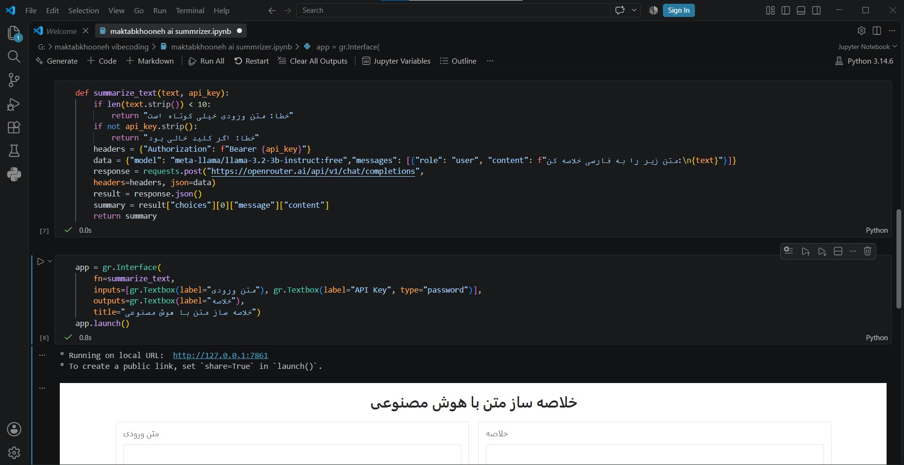
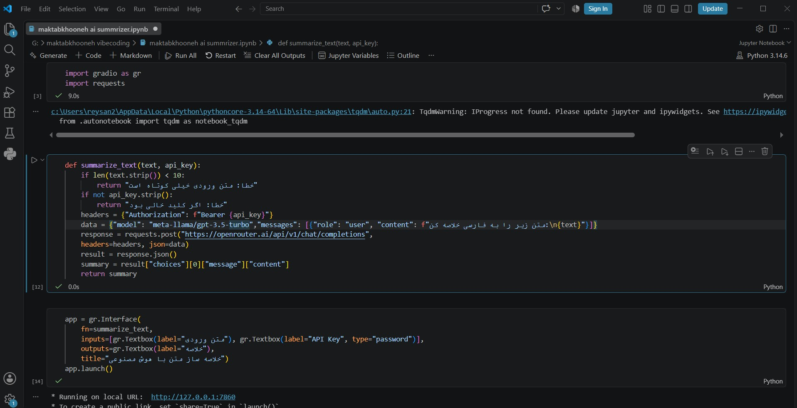
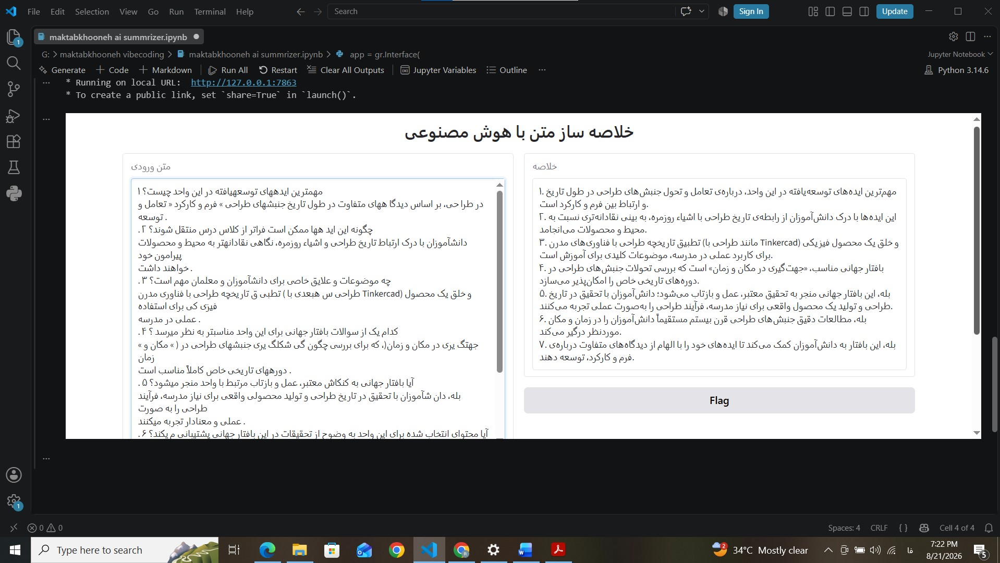
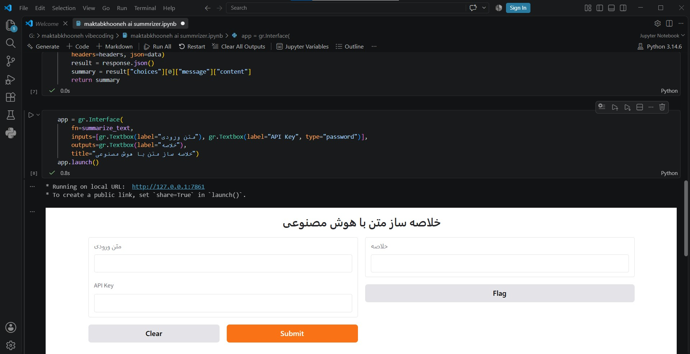

Reyhaneh Sanei <reysanid@gmail.com>
10:59 AM (8 minutes ago)
to poonapashootan7

# Gradio AI Summarizer

An interactive `Gradio` app that summarizes user text by calling an AI model through the `OpenRouter` API.

## What it does

1. The user enters a text and an API key in the interface.
2. A simple validation runs first: an empty key or a very short text returns a message instead of sending a request.
3. The app sends a `POST` request to the OpenAI-compatible endpoint of `OpenRouter`, using the model `[final model name]`, and asks it to summarize the text.
4. The summary is shown in the interface.

The API key is entered at runtime through a `password` field, so it is not stored in the notebook.

## Tech stack

- `Python`, `Gradio`, `requests`
- `OpenRouter` (OpenAI-compatible endpoint)
- Written and run in VS Code, exported as `.ipynb`
- ## Why VS Code instead of Colab

I started this exercise with the plan of using Google Colab, but my VPN connection dropped during the work and Colab was not reachable. I switched to VS Code. The output is still a standard `.ipynb` notebook.

## Challenges

I used an AI assistant to help with the problems below.

- **`!pip` vs `%pip`:** `!pip` sometimes gave a "not recognized" error in the notebook. Using `%pip` fixed it. I applied the fix without fully understanding the reason at the time.
- **Typos and indentation:** I had typos in `Gradio` parameter names (`inputs` / `outputs`) and in the JSON keys of the API response (`choices`, `messages`), plus an indentation error in the function definition. The app did not run until these were fixed.
- **Invalid model name:** the first model name was not valid on `OpenRouter`. Switching to a valid free model solved the error.
- ## Screenshots

### Code
The main function and the `Gradio` interface definition.

### Output
The app summarizing a sample text.

