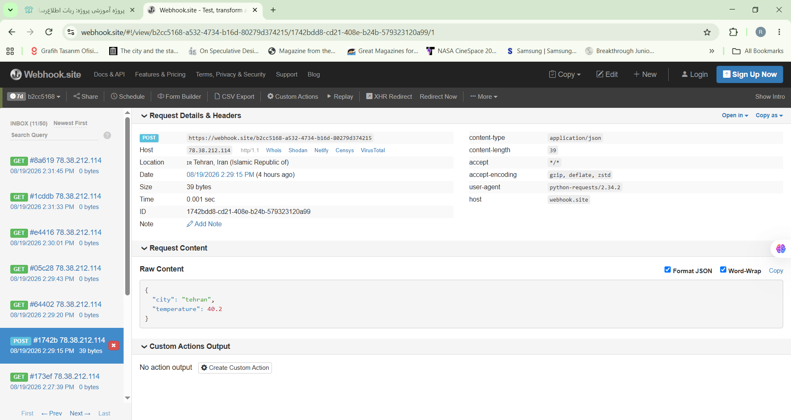

# Weather Webhook Bot

A Python exercise that gets the current temperature of a city from a free weather API and sends the result to two test endpoints with `POST` requests.

## What it does

1. **Get the weather:** the user enters a city name. The app uses the free `Open-Meteo` API to get the coordinates of the city first, and then its current temperature.
2. **Send to Postman Echo:** the city name and temperature are sent with a `POST` request to the `Postman Echo` test service, together with an `Authorization` header in `Bearer token` format. The response confirms that the data and the header arrived correctly.
3. **Send to Webhook.site:** the same data is sent with another `POST` request to a unique URL from `Webhook.site`, and the request can be seen in its panel.

## Tech stack

- `Python`, `requests`
- `Open-Meteo` API (free)
- `Postman Echo` and `Webhook.site` for testing

## Challenges

- **Internet interruption:** the internet connection dropped temporarily while installing `requests` and while sending the request to `Webhook.site`, and at first I did not know what the problem was.
- **Finding the real request in Webhook.site:** the panel showed several `GET` requests (from opening the page directly in the browser) next to the real `POST` request sent by my code, and I had to find the right one. This helped me understand the difference between `GET` and `POST` better.

## Screenshots

### Webhook.site panel
The `POST` request sent by the code, as shown in the `Webhook.site` panel.

