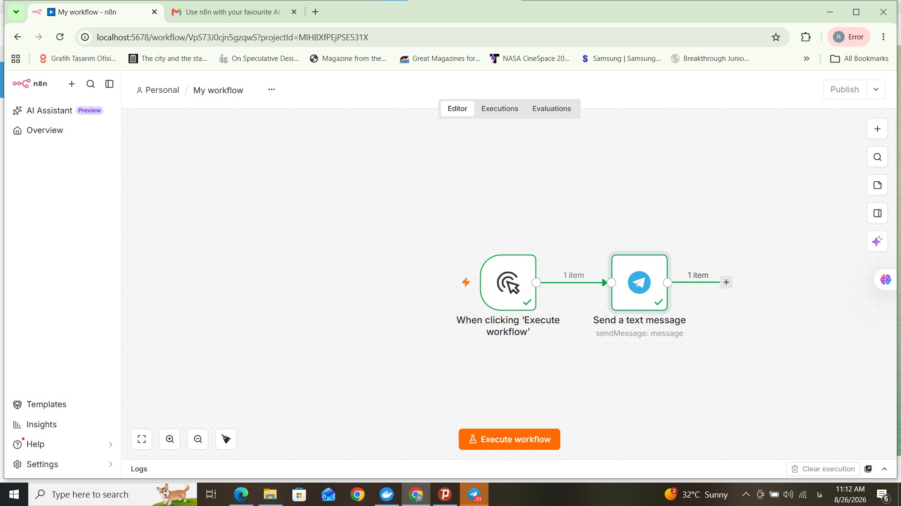
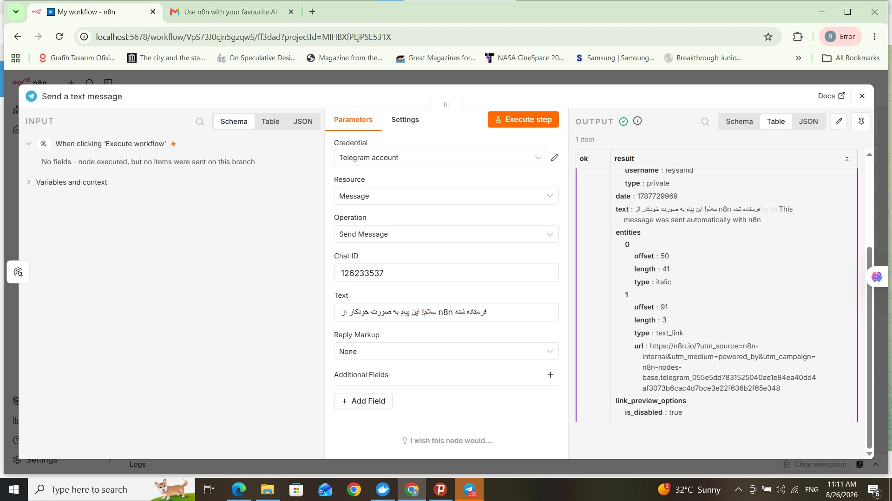
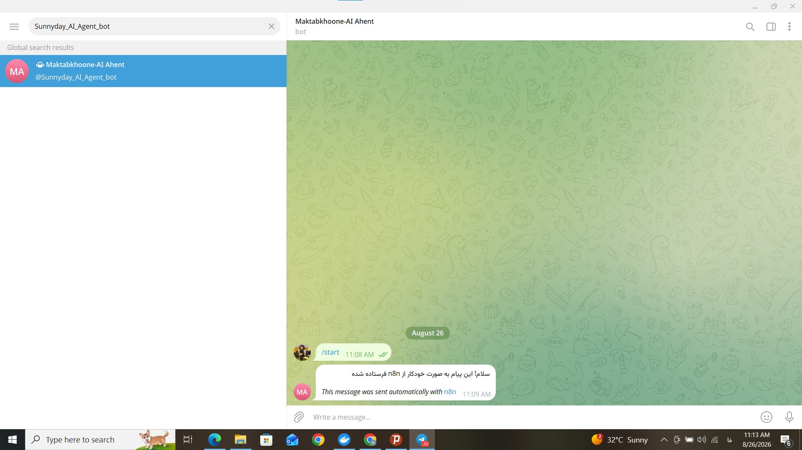

# Telegram Automation

An `n8n` exercise that sends an automatic message to a Telegram bot chat.

## What it does

The workflow starts with a `Manual Trigger` and uses the `Telegram` node (`Send Message`) to send a message to the chat of a Telegram bot.

Manual Trigger → Telegram (Send Message)

## Tech stack

- `n8n` running locally via `Docker`
- `Telegram Bot API` (bot created with `BotFather`)

## Challenges

- **Setting up n8n locally with Docker:** installing and running `n8n` with `Docker` took a lot of time and effort. It took about a full day, with the help of an AI assistant, to understand the errors. Internet filtering and the IP location in Iran made this slower.
- **Telegram access from the container:** Telegram is filtered in Iran, so not only the browser but also the `Docker` container itself needed to reach the internet through a VPN to connect to the Telegram servers.
- **"chat not found" error:** this error appeared at first. After checking, the cause was a wrong bot identity: the chat I used belonged to `BotFather`, not to my own bot.

After fixing these, the workflow ran successfully and the message was received correctly.

## Screenshots

### Workflow

### Test run

### Received message

